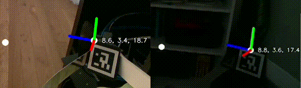

# Visual Servoing with the Stretch 3 Dex Wrist & Gripper


Visual servoing is a powerful way to achieve fast, precise, and robust motions using Stretch 3's D405 gripper camera. This code provides an example of using visual servoing to reach and grasp a target, either a cube with an ArUco marker on it or a tennis ball. It also provides code for estimating the fingertip poses using the finger ArUco markers. 


## ArUco Cube Demo


For this demo, your Stretch robot needs a Dex Wrist 3, which comes with an Intel RealSense D405 depth camera and a gripper with ArUco markers on the fingers. 

First, clone this repository on your robot. 

```
git clone https://github.com/hello-robot/stretch_visual_servoing/
```

Next, find the transparent acrylic cube that came with your robot. It has a 30 mm by 30 mm ArUco marker on it that encodes the ArUco ID# 202. The robot will try to reach for and grab this cube when it sees the ArUco marker with the D405 camera on its gripper. 

Home your robot, if you haven't already. 

```
stretch_robot_home.py
```

Now, go to the home directory of the cloned repository and run the demo code.

```
cd ./stretch_visual_servoing
python3 visual_servoing_demo.py
```

You should now see a display that shows RGB video from the D405 camera. When you show the ArUco cube to the robot, it should try to move the 3D point between its fingertips to the center of the cube and then grasp the cube. 


## Tennis Ball Demo


The tennis ball demo uses [YOLOv8 from Ultralytics](https://github.com/ultralytics/ultralytics). Prior to proceeding, you should run the following installation shell script.

```
cd ./stretch_visual_servoing
./install_yolov8.sh
```

Now, home your robot, if you haven't already. 

```
stretch_robot_home.py
```

### YOLOv8 on the Robot

First, you should try running a small YOLOv8 model on the robot. 

Go to the repository's directory and start the D405 image server

```
cd ./stretch_visual_servoing
python3 send_d405_images.py 
```

You should see an average frequency of around 15 Hz, which is the frame rate used by the D405 on Stretch 3.

Now, open up another terminal, and run the following code to start YOLOv8 processing on the robot. This will use a small model to achieve a sufficient frame rate. 

```
cd ./stretch_visual_servoing
python3 recv_and_yolo_d405_images.py
```

After the code has downloaded the YOLOv8 model and begins running, you should see the result of processing in a video display on the robot. It should look similar to the GIF above. You should see a visualization of the fingertip frames of reference. When you hold up a tennis ball for the robot, you should see it segmented. It should be running with an average frame rate of 13 Hz to 15 Hz.

Now, you can begin the visual servoing process using the following code.

```
cd ./stretch_visual_servoing
python3 visual_servoing_demo.py -y
```


### YOLOv8 Demo with an Off-board Computer

For this example, you'll need an external computer conneccted to the robot via a Ethernet cables or WiFi.

For the best performance, you should use an external computer with a high-end GPU, such as a NVIDIA GeForce RTX 4090, which enables a YOLOv8 segmentation model to be run at 15 Hz. You should also ensure that you have good network connectivity between the external computer and your robot. 

You also need to configure the network settings specified in the file `yolo_network.py` found in the repository.

First, run the D405 image server on the robot using the following code.

```
cd ./stretch_visual_servoing
python3 send_d405_images.py -r
```

Next, start YOLOv8 processing on your external computer using the following code. This assumes your external computer runs the same OS as the robot (Ubuntu 22.04) and has the cloned repository installed.

```
cd ./stretch_visual_servoing
python3 recv_and_yolo_d405_images.py -r
```

After the code has downloaded the YOLOv8 model and begins running, you should see the result of processing in a video display on the external computer. It should look similar to the GIF above. You should see a visualization of the fingertip frames of reference. When you hold up a tennis ball for the robot, you should see it segmented.

Now, go back to the robot and run the following code.


```
cd ./stretch_gripper_camera_demos
python3 visual_servoing_demo.py -y -r
```

## Troubleshooting

If you're having trouble with the steps in the guide, please check the following tips:

### There's jitter in the fingertip tracking



This gif shows what's normal vs. what's an unusual amount of jitter. If you're seeing jitter like on the right, try changing the exposure of the camera. This can improve detection of the finger ArUco markers, which improves tracking of the fingertips.

```
python3 visual_servoing_demo.py --exposure ['low', 'medium', 'auto'] or an integer in range [0, 500000]
```

The `--exposure` flag also works on the `send_d405_images.py` script.
